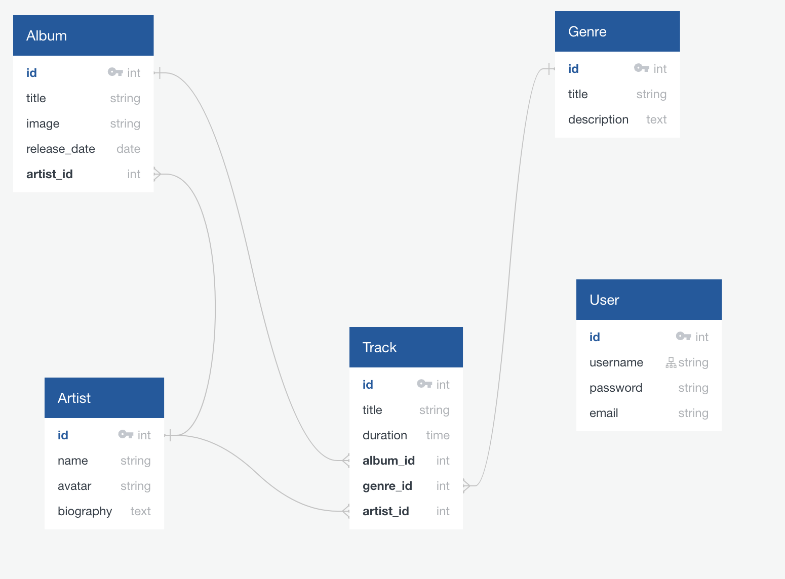

# express-spotilike CLEMENT PAGES

  Ce projet a pour but de développer un backend et frontend permettant de récupérer et d'afficher des artistes, leurs albums et leurs musiques

# Utiliser l'application
## Prérequis
  1. Dans un terminal, se déplacer là où le repo doit être cloné
  2. Cloner le repos : git clone https://github.com/blbcrv/express-spotilike.git
  3. Installer les packages nécessaires : npm install

## Démarrer l'application
  1. Se déplacer dans le dossier app : cd app
  2. Lancer l'application : npm run server

  Pour la base de données, le fichier SQL est présent sur le Git. Il faudra l'importer dans une base.
  Une fois cela fait, creer un fichier dotenv et y insérer les informations de connexion

# Schema relationel de la base de données

